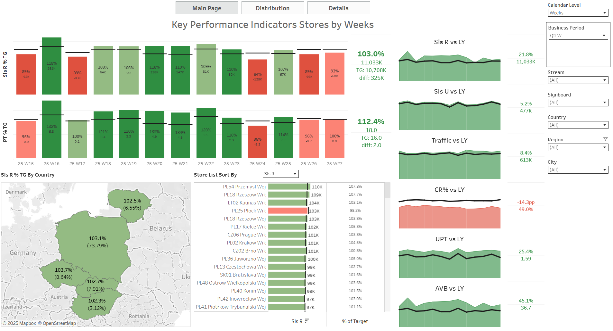
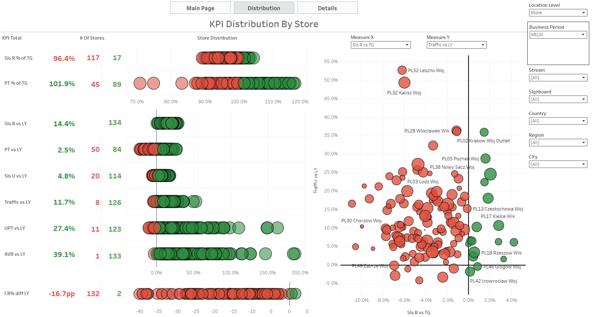
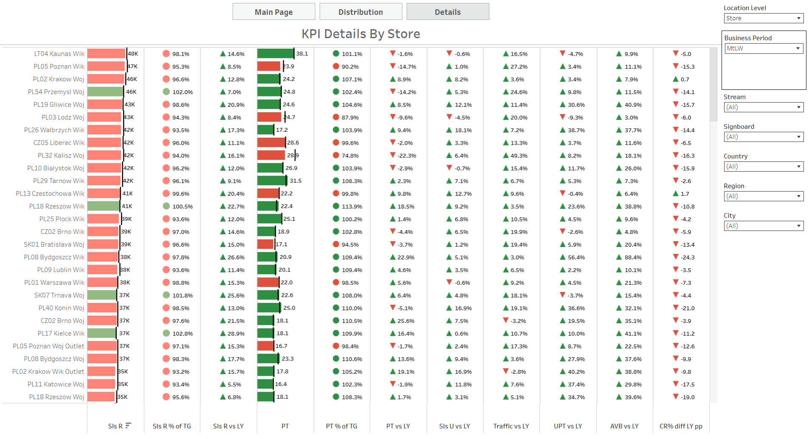

## KPI Store Dashboard
(English Below)

Raport pokazuje kluczowe wskaźniki sprzedaży takie jak: sprzedaż i PT w odniesieniu do celu oraz zeszłego roku, liczba wejść, konwersja, liczba sztuk na paragon, średni koszyk.  
Został zbudowany w Tableau.

### Podgląd raportu
#### 1. KPI Store Main Page
   
Zakładka „Main Page” stanowi główną stronę raportu, prezentującą kluczowe wskaźniki efektywności sprzedaży w ujęciu tygodniowym lub miesięcznym(sterowane za pomocą parametru Calendar Level), geograficznym i operacyjnym. Została zaprojektowana z myślą o szybkiej ocenie wyników względem targetów oraz porównaniu z analogicznym okresem roku poprzedniego.

#####  Główne elementy:
- **Wykresy słupkowe z podsumowaniem**:
  - Realizacja targetu sprzedaży w ujęciu tygodniowym/miesięcznym
- **Wskaźniki YOY** w formie Area chartów+Line i KPI Boxów:
  - Intuicyjna ocena dynamiki zmian dla poszczególnych KPI
- **Mapa**:
  - Realizacja targetu sprzedaży według kraju
- **Tabela MPK**:
  - Szczegółowe wyniki jednostek operacyjnych (MPK) z % realizacji
- **Panel filtrów**:
  - Dynamiczne sterowanie widokiem: Calendar Level, okres biznesowy, kraj, miasto, stream

#### 2. KPI Store Distribution

Zakładka „Distribution” przedstawia rozkład kluczowych wskaźników efektywności w ujęciu lokalizacyjnym za pomocą parametru Location Level(Store, City, Signoboard,Stream).  
Pozwala zidentyfikować jednostki o najwyższej i najniższej dynamice względem roku poprzedniego oraz targetów.

##### Główne elementy:

- **Rozkład KPI vs LY**:
  - Liczba poziomów lokalizacji z lepszą relizacją niż w zeszłym roku ,bądź realizacją celu dla takich miar jak: Sprzedaż, Traffic, Jednostki Sprzedaży (Sls U), Conversion Rate (CR%)
  - Kolorystyka: czerwony (spadek), zielony (wzrost)
- **Scatter plot**:
  - Oś X: `Measure X`
  - Oś Y: `Measure Y`
  - Miary do Wyboru dla Measures: Sls R vs TG, Pt vs TG, Traffic vs LY, AVB vs LY, UPT vs LY
  - Punkty wybierane dla Location Level (np. PL52 Woj)
  - Kolorowanie warunkowe: Gdy obie Measures są pozytywne, to zielony, inaczej czerwony
- **Panel filtrów**:
  - Poziom lokalizacji, Okres biznesowy, Kraj, Miasto, Stream

#### 3. KPI Store – Details

Zakładka „Details” prezentuje szczegółowe dane operacyjne dla każdej jednostki lokalizacyjnej (MPK).  
Zawiera pełen zestaw wskaźników efektywności, umożliwiając granularną analizę wyników sprzedażowych i konwersji.

##### Główne elementy:
- **Tabela Location Level** z KPI:
  - Sprzedaż (Sls R), % realizacji targetu, różnice vs LY
  - PT i jego realizacja względem targetu
  - Traffic, Sls U, UPT, AVB, CR — wszystkie w ujęciu YOY
- **Kolorystyka wartości**:
  - Wykresy oraz ikony, które mają za zadanie ułatwić identyfikację pozytywnych i negatywnych trendów
- **Wiersz podsumowujący**:
  - Łączne wartości dla wszystkich MPK — ocena całościowa
- **Panel filtrów**:
  - Dynamiczne sterowanie widokiem: okres biznesowy, poziom lokalizacji, kraj, miasto, stream

### Raport
Dashboard dostępny publicznie na Tableau Public: [Zobacz w Tableau](https://public.tableau.com/app/profile/wojciech.kaczmarczyk/viz/KPIStoreWK/MainPage)

------------------------------------------

## KPI Store Dashboard

The report presents key sales performance indicators such as: sales and PT compared to target and last year, traffic, conversion rate, units per transaction (UPT), and average basket value (AVB).  
It was built in Power BI using DAX and dynamic parameters.

### Report Overview
#### 1. KPI Store Main Page

The "Main Page" tab is the primary view of the report, presenting key sales performance indicators in weekly or monthly breakdowns (controlled by the **Calendar Level** parameter), as well as geographic and operational perspectives.  
It was designed to provide a quick assessment of results against targets and comparisons with the same period last year.

##### Main elements:
- **Bar chart with KPI Boxes**:
  - Target achievement in weekly/monthly breakdown
- **YOY indicators** in the form of gauges and KPI boxes:
  - Intuitive assessment of dynamics for each KPI
- **Map**:
  - Target achievement by country
  - Detailed information available in tooltips
- **MPK table**:
  - Detailed results of operational units (MPK) with % achievement
- **Filter panel**:
  - Dynamic view control: Calendar Level, business period, country, city, stream

#### 2. KPI Store Distribution

The "Distribution" tab shows the distribution of key performance indicators across locations using the **Location Level** parameter (Store, City, Signboard, Stream).  
It allows identification of units with the highest and lowest dynamics compared to last year and targets.

##### Main elements:
- **KPI distribution vs LY**:
  - Number of location levels performing better than last year or realisation of target for measures such as Sales, Traffic, Units Sold (Sls U), Conversion Rate (CR%)
  - Color coding: red (decline), green (growth)
- **Scatter plot**:
  - X-axis: `Measure X`
  - Y-axis: `Measure Y`
  - Measures available: Sls R vs TG, PT vs TG, Traffic vs LY, AVB vs LY, UPT vs LY
  - Points selected for Location Level (e.g., PL52 Woj)
  - Conditional coloring: green if both measures are positive, otherwise red
- **Filter panel**:
  - Location level, business period, country, city, stream

#### 3. KPI Store – Details

The "Details" tab presents detailed operational data for each location unit (MPK).  
It contains a full set of performance indicators, enabling granular analysis of sales and conversion results.

##### Main elements:
- **Location Level table** with KPIs:
  - Sales (Sls R), % target achievement, differences vs LY
  - PT and its achievement vs target
  - Traffic, Sls U, UPT, AVB, CR — all in YOY breakdown
- **Value color coding**:
  - Charts and icons designed to highlight positive and negative trends
- **Summary row**:
  - Aggregate values for all MPKs — overall assessment
- **Filter panel**:
  - Dynamic view control: business period, location level, country, city, stream

### Raport
Dashboard available publicly on Tableau Public: [View on Tableau](https://public.tableau.com/app/profile/wojciech.kaczmarczyk/viz/KPIStoreWK/MainPage)
